# <center> 媒体计算 Lab 1 - Scene Completion </center>

<center> 计算机科学与技术系 计13&emsp;陈鑫圣&emsp;2021010760 </center>

***


## 实现内容

- Step 1 位置匹配：使用计图实现卷积
- Step 2 计算融合边界：自主完成建图，并自主实现GraphCut算法
- Step 3 自然融合：自主构建泊松融合矩阵、实现稀疏矩阵迭代求解算法
- Step 3 加速算法：使用 MVC 插值加速泊松融合计算

结果文件是 `result/<id>.jpg`，其中 `<id>` 为 1 至 5。


## 环境配置

### Jittor 配置

首先，配置 Jittor 的依赖项。根据 [Jittor 官方安装教程](https://cg.cs.tsinghua.edu.cn/jittor/download/)，

> Jittor 支持**Linux**(e.g. Ubuntu/CentOS/Arch), **macOS**,**Windows**， 其中**Linux**和**macOS**的依赖如下：
> 
> - Python：版本 >= 3.7
> - C++编译器 （需要下列至少一个）
>     - g++ （>=5.4.0 for linux）
>     - clang （>=8.0 for mac）
> - GPU 编译器（可选）：nvcc >=10.0 （可以通过 `sudo apt-get install nvidia-cuda-toolkit` 安装）
> - GPU 加速库（可选）：cudnn-dev (cudnn开发版, 推荐使用tar安装方法，[参考链接](https://docs.nvidia.com/deeplearning/cudnn/install-guide/index.html#installlinux-tar))

然后，安装 Jittor

```bash
sudo apt install python3.10-dev libomp-dev
python3.10 -m pip install jittor
python3.10 -m jittor.test.test_example
# 如果您电脑包含Nvidia显卡，检查cudnn加速库
python3.10 -m jittor.test.test_cudnn_op
```

### 安装依赖

```bash
pip install requirements.txt
```

## 运行

运行以下脚本，直接得到所有输出。

```bash
python run_all.py
```

如果希望打印更详细的信息，并保存中间结果文件，可以

```bash
python run_all.py -v
```

### 运行单个例子

```bash
python main.py 	--scene ./data/completion/input1.jpg  --mask ./data/completion/input1_mask.jpg  --patch ./data/completion/input1_patch.jpg  --result ./result/1.jpg
```

可以加上更多（非必要）参数，例如：

```bash
python main.py 	--scene ./data/completion/input4.jpg  --mask ./data/completion/input4_mask.jpg  --patch ./data/completion/input4_patch.jpg  --result ./result/4.jpg --inter_result ./result/inter_4 --verbose

python main.py 	--scene ./data/completion/input3.jpg  --mask ./data/completion/input3_mask.jpg  --patch ./data/completion/input3_patch.jpg  --result ./result/3_mvc.jpg --inter_result ./result/inter_3_mvc --verbose  --mvc
python main.py 	--scene ./data/completion/input5.jpg  --mask ./data/completion/input5_mask.jpg  --patch ./data/completion/input5_patch.jpg  --result ./result/5.jpg --inter_result ./result/inter_5 --verbose --maxflow
```

|       参数       |                                      含义                                       |
| :--------------: | :-----------------------------------------------------------------------------: |
|   `--verbose`    |                            打印程序执行中的更多信息                             |
| `--inter_result` |                                保存中间结果图片                                 |
|   `--maxflow`    | Step 2 计算 Graph-cut 使用基于 `maxflow` 库实现的版本（否则使用自主实现的版本） |
|     `--mvc`      |              Step 3 使用 MVC （否则解稀疏矩阵方程组进行泊松融合）               |

所有参数详细用法可以通过 `python main.py -h` 查看。


## 实现思路

### Step 1: 精细匹配

本部分代码主要在 `select_match.py`。

首先计算 local context。这一过程我使用了 BFS 自主实现，没有调用开源库。从 mask 区域开始执行 BFS，所有与 mask 的 L1 距离在 80 像素之内的区域都属于 local context。这里 80 采用了原论文给出的数值。

然后选择 patch 图像中和待补全的 scene 图像在 local context 上最匹配的区域。注意到，不同图片的语义尺寸可能不同，所以我先对其中一张（这里选择了 patch 图片）进行缩放，这个缩放比例的尝试范围可以通过 `scale_min` 和 `scale_max` 进行设置（设置更大的范围，程序将尝试这个更大范围内的缩放）。

再将每个缩放的版本与 scene 进行比较；将 scene 在 patch 上进行平移，比较每个位置的 L2 误差。这个误差计算使用了基于 Jittor 实现的卷积。参考了 [Jittor 官方教程](https://cg.cs.tsinghua.edu.cn/jittor/tutorial/2020-3-17-09-50-meta_op/)。

<!-- 在作业 ppt 要求的基础上，还增加了用梯度图来刻画图像纹理，让选择的 patch 区域在 local context 上的梯度与原图较为接近。 -->

结果如下。分别为 local context 区域、scene 截取 local context 的结果和选取的 patch。
<div align=center> 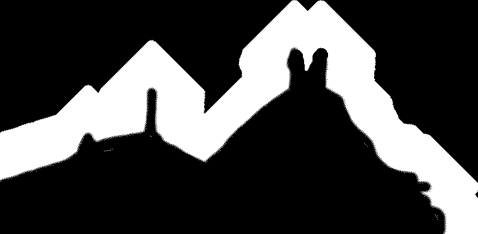 </div>
<div align=center> 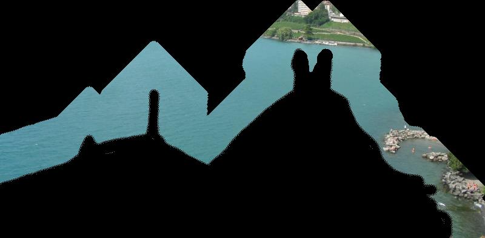 </div>
<div align=center>  </div>


### Step 2: 计算融合边界

自主完成建图，并自主实现 GraphCut 算法（也实现了用 `maxflow` 库计算的版本）。这部分代码主要位于 `graph_cut.py`。

使用了 Graph-cut 算法（[论文](https://www.think-cell.com/assets/en/career/talks/pdf/think-cell_article_siggraph2003.pdf)、 [主页](https://sites.cc.gatech.edu/cpl/projects/graphcuttextures/)）来计算图像融合边界。
<div align=center> 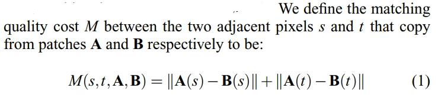 </div>

按照该论文建图。于是问题转化为计算最小割，即计算最大流。

我首先实现了用 `maxflow` 库计算的版本。参考了[官方文档](https://pmneila.github.io/PyMaxflow/maxflow.html)。

<!-- maxflow 官方文档主页：https://pmneila.github.io/PyMaxflow/ -->
<!-- maxflow 官方文档：https://pmneila.github.io/PyMaxflow/maxflow.html -->

然后自主实现了计算最大流-最小割，采用了 Edmonds-Karp 算法。由于自主实现的版本相对于 `maxflow` 库（其底层实现为 C 代码）较慢，所以我在实现 Edmonds-Karp 算法 时，对寻找增流路径的次数设置了上限（该参数可以通过 `my_graphcut_max_bfs` 来调整，值越大则运行时间越长，默认为 2000）。

使用自主实现 Graph-cut 的版本，单一测例的总运行时间大约是 6-7 分钟（`my_graphcut_max_bfs` 为 2000）；
<!-- ，4分钟（`max_bfs` 为 1000） -->
使用 `maxflow` 库大约为 20 秒钟。（以上时间均为 Step 3 不使用 MVC 的情况下的时间，本地测试）。

结果如下。分别为 graph-cut 的结果和该区域对应的 patch（这部分将会被用于填补）。
<center class="half">
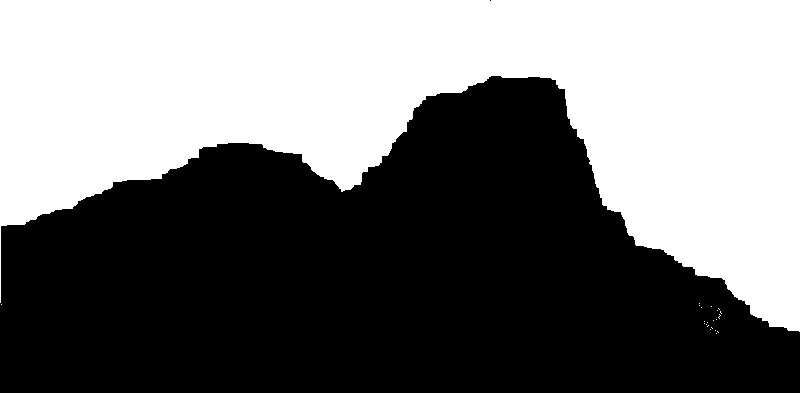
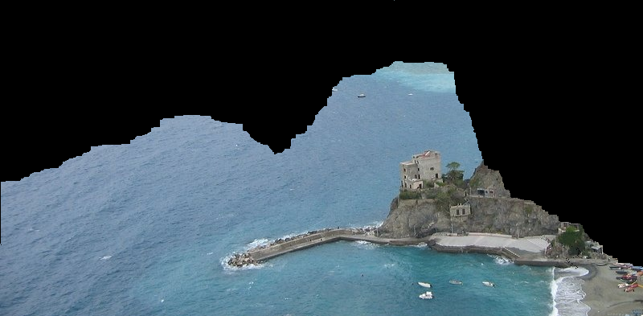
</center>


### Step 3: 自然融合两张图像

自主构建泊松融合矩阵、自主实现稀疏矩阵迭代求解算法（也实现了调用开源库解稀疏矩阵方程组的版本）。本部分代码主要位于 `poisson_blending.py`。

#### 构建泊松融合矩阵

关于泊松融合，参考了 [Poisson Image Editing. P Pérez et. al. SIGGRAPH 2003](https://www.cs.jhu.edu/~misha/Fall07/Papers/Perez03.pdf)。具体而言，根据该论文，我构建的待解方程组为
<div align=center> 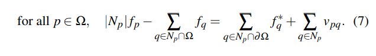 </div>

<!-- 泊松融合参考：https://blog.csdn.net/TracelessLe/article/details/113270697 -->

关于构建矩阵，有两种思路：
- 思路A：对每个颜色通道解一次方程组
- 思路B：把所有颜色通道合成一个 3n x 3n 的大方程组

我都进行了尝试（性能测试结果见下表），最后选用思路A。（思路B的代码被注释掉。）

#### 实现稀疏矩阵迭代求解算法

我首先实现了调用开源库 `scipy` 解稀疏矩阵方程组的版本。参考了[官方文档](https://docs.scipy.org/doc/scipy/reference/generated/scipy.sparse.linalg.cg.html)。
<!-- scipy 的稀疏矩阵方程组求解： https://docs.scipy.org/doc/scipy/reference/generated/scipy.sparse.linalg.cg.html -->

一开始自主实现了 Gauss-Seidel 迭代法，性能过低（参考下表）。后来自主实现共轭梯度法。分别为 `gauss_seidel_sparse`, `conjugate_gradient_sparse` 函数。

使用 `scipy.sparse.linalg.cg`、自主实现 Gauss-Seidel 迭代法求解、自主实现共轭梯度法求解的性能效果如下：

|                              | 对每个颜色通道解一次方程组 | 把所有颜色通道合成一个 3n x 3n 的大方程组 |
| :--------------------------: | :------------------------: | :---------------------------------------: |
|   `scipy.sparse.linalg.cg`   |       5.82s (8.01s)        |              9.34s (12.20s)               |
| 自主实现 Gauss-Seidel 迭代法 |         约 21 min          |                 约 21 min                 |
|    **自主实现共轭梯度法**    |  **<u>6.23s</u> (6.63s)**  |             **6.95s (7.15s)**             |

- 以上测试使用给出的第 1 个测例，`tol` 为 `1e-5`, `max_iter` 为 `1000`；graph-cut 版本是调用 `maxflow` 的版本；没有使用 MVC。所有数据均在本地环境重复 5 次测试取平均值。
- 其中括号内的时间是不给出解的迭代初值 `x0` 情况下的时间。
- 加粗且加下划线的为最终采用的版本。其它版本都保留在代码中，但（调用部分的代码）被注释掉。

结果如下。分别为填补区域的 patch 原图，和经过融合算法之后的图。
<center class="half">

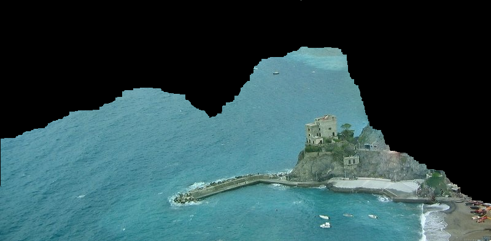
</center>

### MVC (Mean-Value Coordinate)

参考了论文 [Coordinates for Instant Image Cloning](https://dl.acm.org/doi/10.1145/1576246.1531373)。MVC 的核心算法如下（论文中的  Algorithm 1 MVC Seamless Cloning）。
<div align=center> 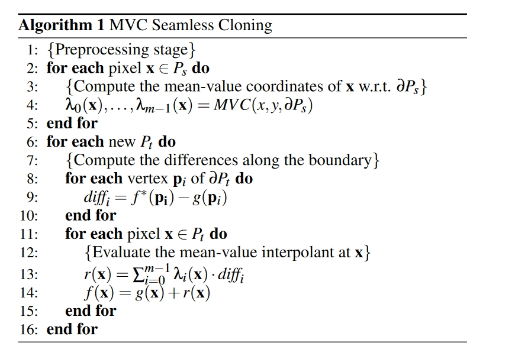 </div>

使用 MVC 大约需要 90 秒；不使用大约 20 秒。（以上时间均为 Step 2 使用基于 `maxflow` 库计算 Graph-cut 的情况下的时间，本地测试）。
<!-- 380s, 105s 108 79, 39-->

## 结果

下面是结果图片。从左到右各版本如下

|       | Step 2 计算 Graph-cut  |      Step 3 图像融合       |
| :---: | :--------------------: | :------------------------: |
| 左 1  |     使用 `maxflow`     | 解稀疏矩方程组，未使用 MVC |
| 左 2  | 自主实现计算 Graph-cut | 解稀疏矩方程组，未使用 MVC |
| 左 3  | 自主实现计算 Graph-cut |          使用 MVC          |

<center class="half">
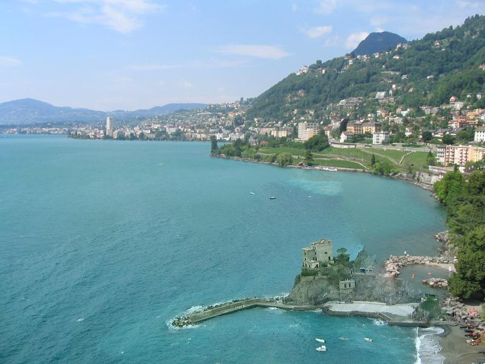
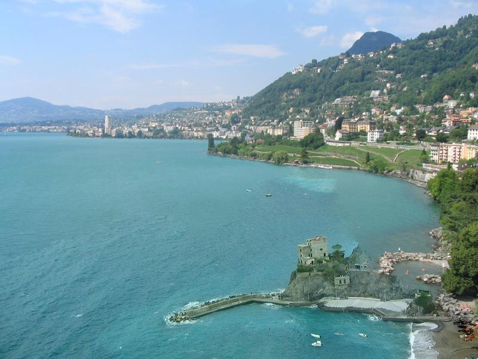
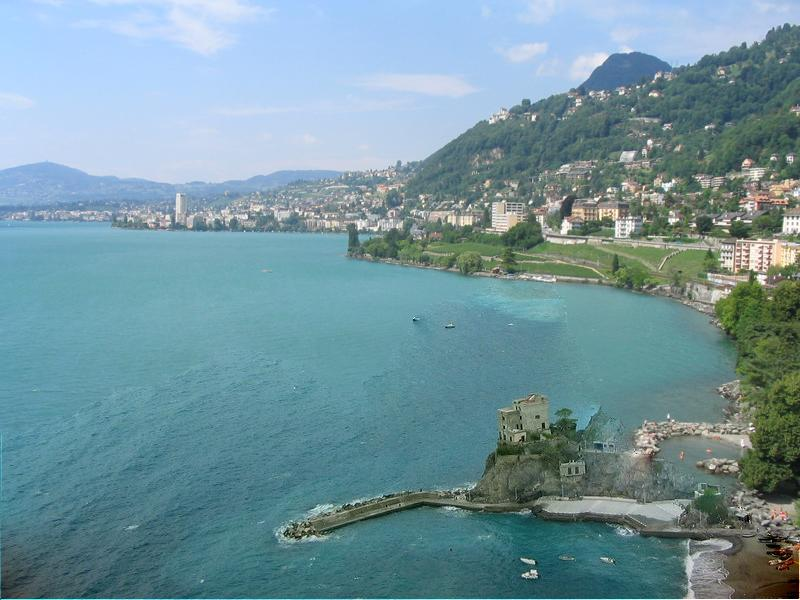
</center>
<center class="half">
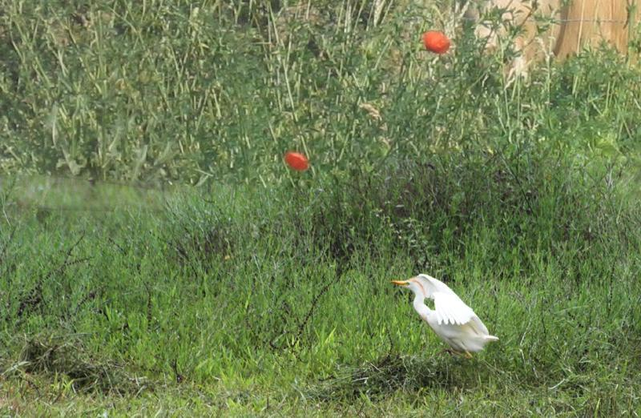
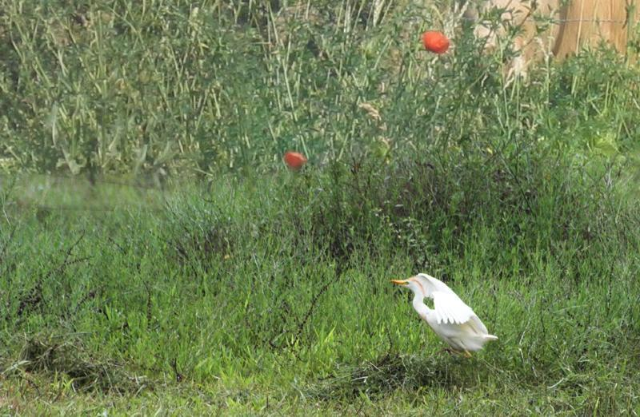
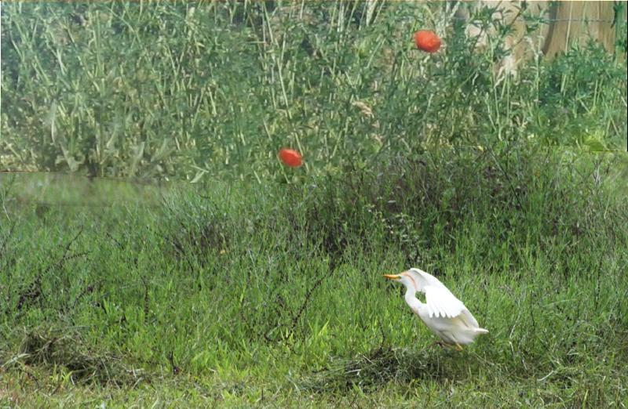
</center>
<center class="half">


</center>
<center class="half">
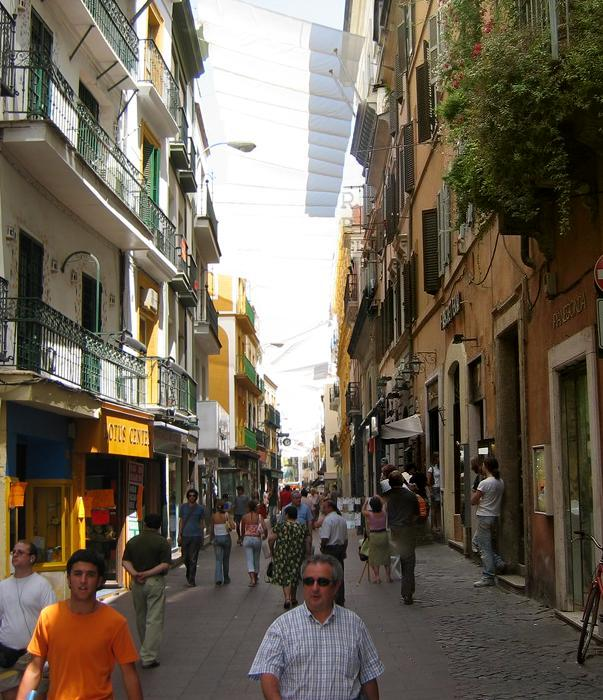
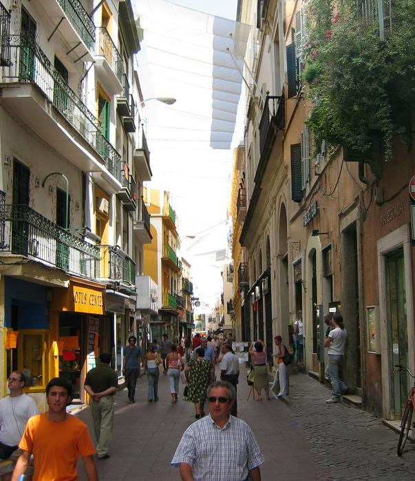

</center>
<center class="half">
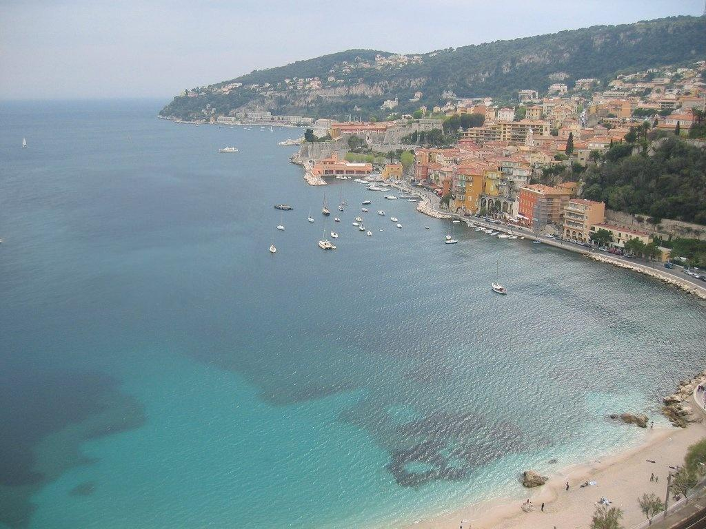

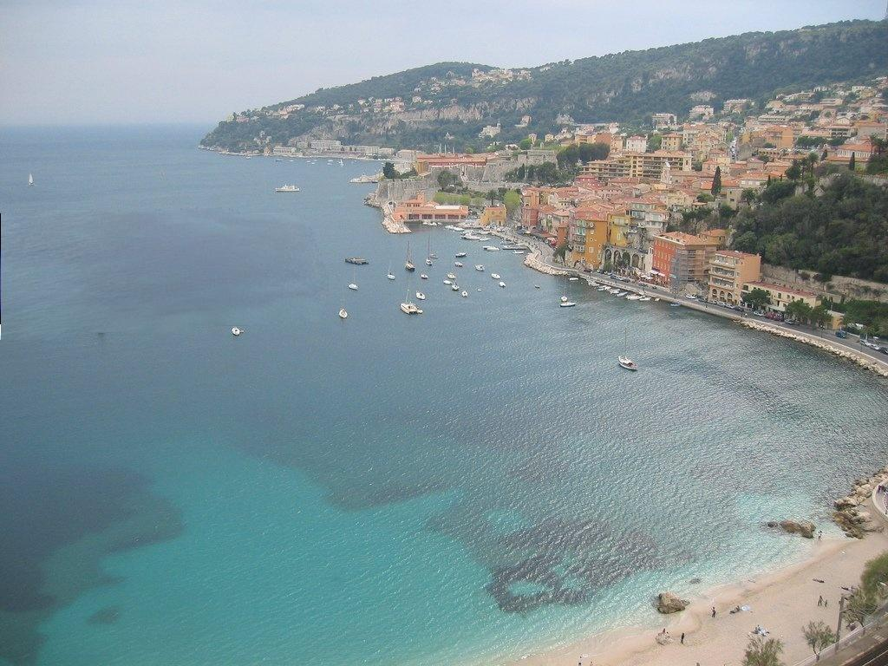
</center>

`result/` 中的结果的版本对应左 2。

